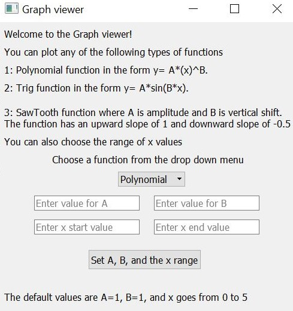
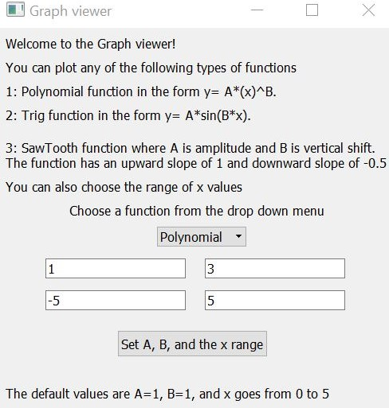
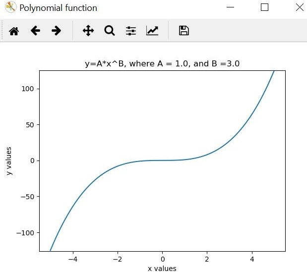
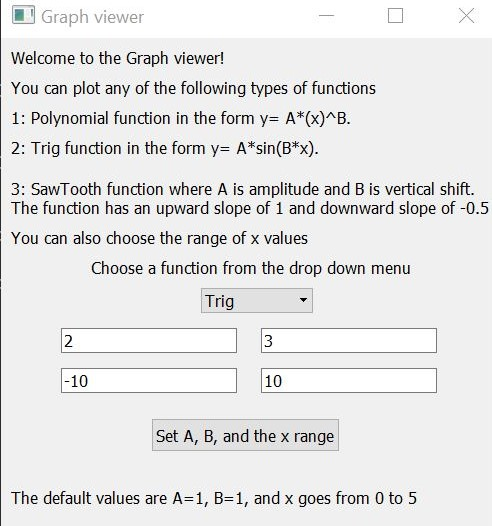
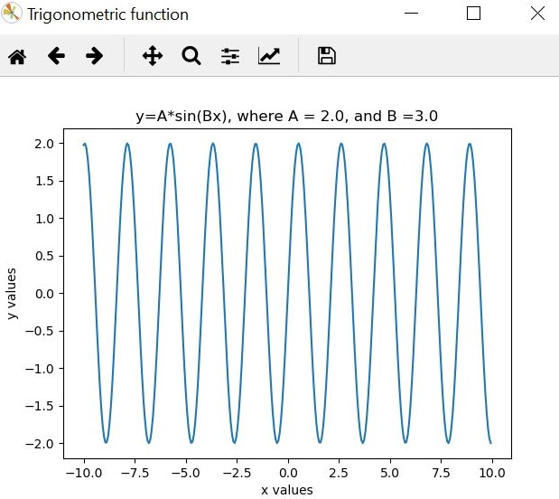
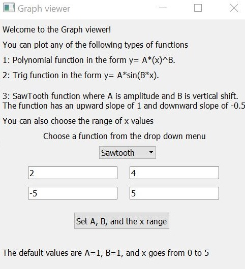
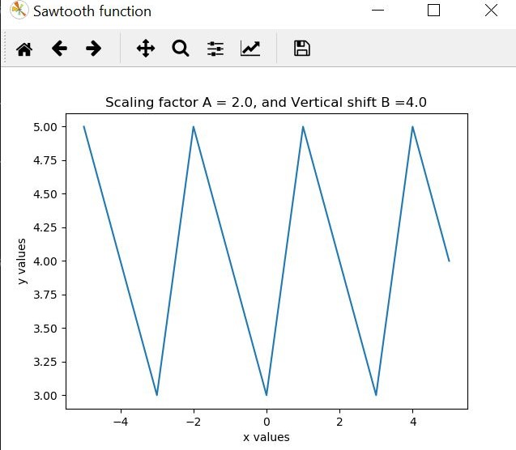

# CZ Biohub R&D Engineer Programming Challenge (For OOP practice)
Graph plotter that allows users to plot various functions with user-adjustable parameters.

Implemented a graph plotter using Object Oriented Programming in Python

● The user gets to choose from a list of functions, such as polynomial, trigonometric, as well as functions with 
no simple mathematical representation (SawTooth function)

● Each function is implemented as its own class, which extends an abstract class Function. 

● As soon as the user selects the type of function to plot, the graph viewer plots the function with default parameters.  

● The user can adjust the x-range, and the various parameters of functions (such as amplitude and period for trigonometric functions)  

● As soon as any parameter is change, the viewer refreshes and shows the new plot. 

● The viewer should re-plot the function whenever the A and B parameters or the X
range are changed.

● The program handles invalid user inputs

The three types of functions are as follows:
1. Polynomial function in the form of y= A*(x)^B
2. Trigometric function in the form of y=A*sin(B*x)
3. Sawtooth function with an upward slope of 1 and downward slope of -0.5. Each asymmetric triangle has a width of 3 x-units. User can adjust amplitude A and vertical shift B

● A GUI allows the user to select the function to plot, to enter values of A, B and the range of x. PyQT was used to program the GUI.

Here are few examples to show how this program runs.

  

The graphical user interface shows the user the different type of functions that can be plotted. A user can select the function from a drop down menu, and then enter the parameters for the graph. The default values are also shown. 

  

  

The figures above show an example of the polynomial function y=1*x^3, with a range that goes from -5 to 5. A few other examples supported by the viewer include square roots and inverse functions.

  

  

The figures above show an example of a trigonometric function y=2*sin(3*x) with x range [-10,10]

  

  

Figures above show an example of a sawtooth graph, with an amplitude of 2 and vertical shift of 4. In this case, the range goes from -5 to 5

# Dependencies:
pip install numpy

pip install pyqt5

# Run:
Running main.py will open the GUI
